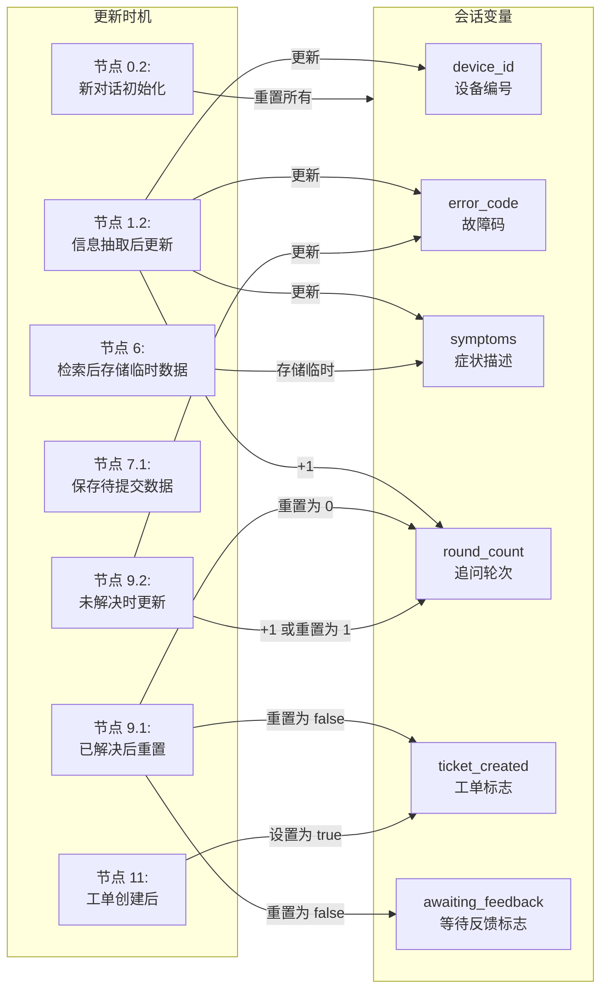
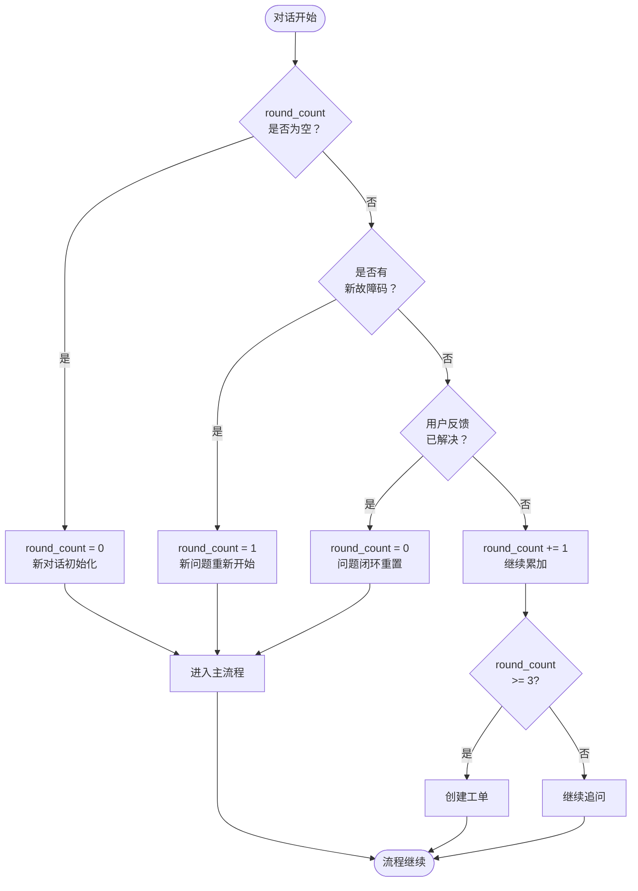

# 换电运维助手 - 企业级详细设计文档

> 版本：v1.0  
> 更新日期：2026-05-22  
> 状态：待实现

---

## 一、系统架构

```
┌─────────────────────────────────────────────────────────────────────────────┐
│                              Dify Chatflow                                   │
│  ┌─────────────┐  ┌─────────────┐  ┌─────────────┐  ┌─────────────────────┐ │
│  │  意图识别    │  │  信息抽取    │  │  并行检索    │  │  诊断生成           │ │
│  │  (LLM)      │  │  (LLM)      │  │  (HTTP+RAG) │  │  (LLM)            │ │
│  └─────────────┘  └─────────────┘  └─────────────┘  └─────────────────────┘ │
│         │                │                │                    │             │
│         ▼                ▼                ▼                    ▼             │
│  ┌─────────────────────────────────────────────────────────────────────────┐│
│  │                        会话变量管理层                                    ││
│  │  device_id, error_code, symptoms, round_count, ticket_created          ││
│  └─────────────────────────────────────────────────────────────────────────┘│
└─────────────────────────────────────────────────────────────────────────────┘
                                    │
                                    ▼
┌─────────────────────────────────────────────────────────────────────────────┐
│                              外部服务层                                      │
│  ┌──────────────┐  ┌──────────────┐  ┌──────────────┐  ┌─────────────────┐ │
│  │  长期记忆服务  │  │  Dify 知识库  │  │  工单系统     │  │  日志/监控       │ │
│  │  (dify-bridge)│  │  (Weaviate)  │  │  (待定)      │  │  (ELK/Prometheus)│ │
│  └──────────────┘  └──────────────┘  └──────────────┘  └─────────────────┘ │
└─────────────────────────────────────────────────────────────────────────────┘
```

---

## 二、会话变量详细设计

### 2.1 变量分类

| 类别 | 变量名 | 类型 | 生命周期 | 说明 |
|------|--------|------|---------|------|
| **核心变量** | `device_id` | String | 对话持续 | 设备编号 |
| | `device_name` | String | 对话持续 | 设备名称 |
| | `error_code` | String | 对话持续 | 故障码 |
| | `symptoms` | String | 对话持续 | 症状描述 |
| **流程控制** | `round_count` | Number | 对话持续 | 追问轮次（0-3） |
| | `ticket_created` | Boolean | 对话持续 | 是否已创建工单 |
| | `is_resolved` | Boolean | 单轮 | 问题是否解决 |
| **临时上下文** | `search_query` | String | 单轮 | 检索关键词 |
| | `memory_results` | Array | 单轮 | 长期记忆检索结果 |
| | `kb_results` | Array | 单轮 | 知识库检索结果 |
| | `diagnosis_output` | String | 单轮 | LLM 诊断输出 |

### 2.2 变量初始化（Chatflow 开始）

**前置配置**: 在 Dify Chatflow 页面预先配置会话变量：
- `round_count` (Number)
- `ticket_created` (Boolean)
- `is_resolved` (Boolean)
- `device_id`, `device_name`, `error_code`, `symptoms` (String)
- `search_query`, `memory_results`, `kb_results`, `diagnosis_output` (String/Array)

**触发时机**: 
- 仅在**新对话的第一轮**执行完整初始化
- 后续轮次只重置临时变量

**判断新对话的方法**:

Dify 中，新对话开始时所有会话变量默认为**空值**。通过条件分支判断：

```yaml
# 方法 1：条件分支判断
条件 1 (新对话):
  {{#conversationVariables.round_count#}} == null OR 
  {{#conversationVariables.round_count#}} == ""

条件 2 (后续轮):
  {{#conversationVariables.round_count#}} != null AND 
  {{#conversationVariables.round_count#}} != ""
```

**Chatflow 节点配置**:

```
┌─────────────────────────────────────────────────────────┐
│  用户输入                                                │
└─────────────────────────────────────────────────────────┘
                            │
                            ▼
┌─────────────────────────────────────────────────────────┐
│  节点 A: 代码节点（判断是否新对话）                       │
│  输入：existing_round_count = {{#conversationVariables.round_count#}}
│  输出：is_new_conversation (true/false)                 │
└─────────────────────────────────────────────────────────┘
                            │
                            ▼
┌─────────────────────────────────────────────────────────┐
│  节点 B: 条件分支                                         │
│  - is_new_conversation == true → 节点 C: 变量赋值        │
│  - is_new_conversation == false → 跳过初始化，继续主流程 │
└─────────────────────────────────────────────────────────┘
```

**代码节点（节点 A）**:
```python
def main(existing_round_count) -> dict:
    """
    判断是否新对话
    
    Dify 中，空会话变量传过来是 None 或空字符串
    """
    is_new = existing_round_count is None or existing_round_count == ""
    
    return {
        "is_new_conversation": is_new
    }
```

**变量赋值节点（节点 C）**:

在 Dify 的变量赋值节点配置以下操作：

| 变量名 | 赋值 | 说明 |
|--------|------|------|
| `conversationVariables.round_count` | 0 | 重置轮次计数 |
| `conversationVariables.ticket_created` | False | 重置工单标志 |
| `conversationVariables.is_resolved` | False | 重置解决状态 |
| `conversationVariables.search_query` | "" | 重置临时变量 |
| `conversationVariables.memory_results` | [] | 重置临时变量 |
| `conversationVariables.kb_results` | [] | 重置临时变量 |
| `conversationVariables.diagnosis_output` | "" | 重置临时变量 |

**变量生命周期说明**:

| 变量 | 新对话初始化 | 每轮重置 | 问题解决后 | 工单创建后 |
|------|------------|---------|-----------|-----------|
| `device_id` | 清空 | 保留 | 保留 | 保留 |
| `error_code` | 清空 | 保留 | 保留 | 保留 |
| `symptoms` | 清空 | 保留 | 保留 | 保留 |
| `round_count` | 0 | 保留 | 0 | 保留 |
| `ticket_created` | False | 保留 | False | True |
| `is_resolved` | False | False | True | False |
| `search_query` | "" | "" | - | - |
| `memory_results` | [] | [] | - | - |

---

## 三、节点详细配置

### 节点 1: 意图识别 + 信息抽取

**节点类型**: LLM

**模型配置**:
- 模型：qwen2.5:1.5b 或更高级模型
- Temperature: 0.1（保证输出稳定）
- Max Tokens: 500

**System Prompt**:
```markdown
你是换电运维助手的意图识别和信息抽取专家。

【任务】
1. 判断用户意图类型
2. 抽取关键实体信息
3. 生成检索关键词

【意图类型】
- fault_report: 故障上报（设备出现问题）
- status_query: 状态查询（询问设备状态）
- maintenance: 维护咨询（保养、巡检相关）
- manual_transfer: 转人工（要求人工客服）
- complaint: 投诉建议
- other: 其他

【抽取字段】
- device_id: 设备编号（格式：XXX-XX-XXX 或自定义编号）
- device_name: 设备名称（如 1 号充电桩、2 号电池包）
- error_code: 故障码（格式：E+ 数字，如 E001）
- symptoms: 症状描述（用户描述的问题现象）
- urgency_keywords: 紧急程度关键词（如"马上"、"紧急"、"快点"）

【查询改写】
将用户口语化描述改写为适合检索的专业关键词：
- 同义词扩展（断电→供电中断、停电、掉电）
- 添加相关故障码（如提到断电，添加 E001）
- 提取核心名词和动词

【输出格式】
只输出 JSON，不要其他内容：
{
  "intent": "fault_report|status_query|maintenance|manual_transfer|complaint|other",
  "entities": {
    "device_id": "提取的设备编号，没有则为 null",
    "device_name": "提取的设备名称，没有则为 null",
    "error_code": "提取的故障码，没有则为 null",
    "symptoms": "症状描述原文",
    "urgency_keywords": ["紧急词汇列表"]
  },
  "search_query": "改写后的检索关键词，用空格分隔",
  "has_device_info": true/false,
  "confidence": 0.0-1.0
}

【示例 1】
用户输入："IEVC-3.0-001 充电桩充电时突然断电，显示 E001，很着急！"
输出：
{
  "intent": "fault_report",
  "entities": {
    "device_id": "IEVC-3.0-001",
    "device_name": "充电桩",
    "error_code": "E001",
    "symptoms": "充电时突然断电",
    "urgency_keywords": ["很着急"]
  },
  "search_query": "充电断电 E001 供电中断 停电",
  "has_device_info": true,
  "confidence": 0.95
}

【示例 2】
用户输入："转人工客服"
输出：
{
  "intent": "manual_transfer",
  "entities": {
    "device_id": null,
    "device_name": null,
    "error_code": null,
    "symptoms": null,
    "urgency_keywords": []
  },
  "search_query": "",
  "has_device_info": false,
  "confidence": 1.0
}
```

**输出变量**: `#intent_extraction.text`

**后置处理**（代码节点）:
```python
def main(llm_output: str) -> dict:
    """解析 LLM 输出，设置会话变量"""
    import json
    
    try:
        data = json.loads(llm_output)
    except:
        # 解析失败，返回默认值
        return {
            "intent": "other",
            "entities": {},
            "search_query": "",
            "has_device_info": False,
            "parse_error": True
        }
    
    return {
        "intent": data.get("intent", "other"),
        "device_id": data.get("entities", {}).get("device_id"),
        "device_name": data.get("entities", {}).get("device_name"),
        "error_code": data.get("entities", {}).get("error_code"),
        "symptoms": data.get("entities", {}).get("symptoms"),
        "search_query": data.get("search_query", ""),
        "has_device_info": data.get("has_device_info", False),
        "confidence": data.get("confidence", 0),
        "parse_error": False
    }
```

---

### 节点 2: 意图分支处理

**节点类型**: 条件分支

**条件配置**:

| 分支 | 条件 | 下一节点 |
|------|------|---------|
| 转人工 | `#intent_extraction.intent` == "manual_transfer" | 节点 2.1: 转人工处理 |
| 投诉 | `#intent_extraction.intent` == "complaint" | 节点 2.2: 投诉处理 |
| 故障上报 | `#intent_extraction.intent` == "fault_report" | 节点 3: 并行检索 |
| 其他 | 默认 | 节点 3: 并行检索 |

---

### 节点 2.1: 转人工处理

**节点类型**: 直接回复

**回复内容**:
```
好的，已为您转接人工客服。

当前值班状态：{{#is_business_hours#}}
{{#IF is_business_hours == true}}
客服人员将在 1-2 分钟内响应您的问题。
{{#ELSE}}
当前是非工作时间（工作时间：工作日 9:00-18:00），值班人员将在下一个工作时间联系您。

如需紧急处理，请拨打值班电话：400-XXX-XXXX
{{#ENDIF}}

【已为您记录】
会话 ID: {{#conversation.id#}}
时间：{{#sys.time#}}
```

**并行操作**（HTTP 请求）:
```yaml
URL: http://<工单系统>/api/tickets
Method: POST
Body:
  type: manual_transfer
  conversation_id: {{#conversation.id#}}
  user_input: {{#sys.query#}}
  priority: high
  status: pending
```

---

### 节点 3: 长期记忆检索（并行）

**节点类型**: HTTP 请求

**超时设置**: 2 秒

**配置**:
```yaml
URL: http://172.17.0.1:8000/api/v1/dify/memory/search
Method: POST
Headers:
  Content-Type: application/json
  X-Request-Timeout: "2000"
Body:
  query: {{#intent_extraction.search_query#}}
  device_id: {{#conversationVariables.device_id#}}
  error_code: {{#conversationVariables.error_code#}}
  top_k: 5
```

**错误处理**:
```python
def main(response: dict, error: str) -> dict:
    """处理检索结果和错误"""
    if error:
        # API 调用失败，返回空结果（降级）
        return {
            "success": False,
            "cases": [],
            "total": 0,
            "error": error,
            "fallback": True
        }
    
    return {
        "success": True,
        "cases": response.body.get("cases", []),
        "total": response.body.get("total", 0),
        "error": None,
        "fallback": False
    }
```

**输出变量**: `#memory_search.*`

---

### 节点 4: 知识库检索（并行）

**节点类型**: 知识库检索

**配置**:
```yaml
知识库：
  - 维修方案（优先级：高）
  - 故障码表（优先级：高）
  - 维修手册（优先级：中）
查询变量：{{#intent_extraction.search_query#}}
最大召回：5
最低相似度：0.6
```

**错误处理**（代码节点）:
```python
def main(kb_result: dict) -> dict:
    """处理知识库检索结果"""
    chunks = kb_result.get("chunks", [])
    
    # 过滤低质量结果
    high_quality = [c for c in chunks if c.get("score", 0) >= 0.6]
    
    return {
        "success": True,
        "chunks": high_quality,
        "total": len(high_quality),
        "fallback": len(high_quality) == 0
    }
```

**输出变量**: `#kb_search.*`

---

### 节点 5: 结果合并与排序

**节点类型**: 代码执行

**代码**:
```python
def main(memory_result: dict, kb_result: dict, entities: dict) -> dict:
    """
    合并长期记忆和知识库检索结果
    去重、排序、标注来源
    """
    import json
    from datetime import datetime
    
    all_docs = []
    seen_contents = set()
    
    # 1. 先添加长期记忆（优先级高，因为是实际案例）
    for case in memory_result.get("cases", []):
        content = f"{case.get('symptoms')} - {case.get('solution')}"
        if content not in seen_contents:
            all_docs.append({
                "source": "历史维修记录",
                "source_type": "memory",
                "content": content,
                "error_code": case.get("error_code"),
                "hit_count": case.get("hit_count", 0),
                "created_at": case.get("created_at"),
                "score": 1.0 + case.get("hit_count", 0) * 0.1  # 命中次数加分
            })
            seen_contents.add(content)
    
    # 2. 添加知识库结果
    for chunk in kb_result.get("chunks", []):
        content = chunk.get("text", "")
        if content not in seen_contents:
            metadata = chunk.get("metadata", {})
            all_docs.append({
                "source": metadata.get("source", "知识库"),
                "source_type": "knowledge_base",
                "content": content,
                "score": chunk.get("score", 0.5)
            })
            seen_contents.add(content)
    
    # 3. 按分数排序
    all_docs.sort(key=lambda x: x.get("score", 0), reverse=True)
    
    # 4. 更新会话变量（如果检索到新的 error_code）
    updated_error_code = entities.get("error_code")
    if not updated_error_code and all_docs:
        for doc in all_docs:
            if doc.get("error_code"):
                updated_error_code = doc["error_code"]
                break
    
    return {
        "merged_docs": all_docs,
        "total_count": len(all_docs),
        "has_data": len(all_docs) > 0,
        "sources": list(set(d.get("source") for d in all_docs)),
        "updated_error_code": updated_error_code
    }
```

**输出变量**: 
- `#merge_results.merged_docs`
- `#merge_results.total_count`
- `#merge_results.has_data`
- `#merge_results.sources`

---

### 节点 6: 会话变量更新

**节点类型**: 变量赋值

**赋值操作**:
```yaml
# 更新核心变量（如果检索到）
conversationVariables.device_id = {{#intent_extraction.device_id#}} OR {{#conversationVariables.device_id#}}
conversationVariables.device_name = {{#intent_extraction.device_name#}} OR {{#conversationVariables.device_name#}}
conversationVariables.error_code = {{#merge_results.updated_error_code#}} OR {{#conversationVariables.error_code#}}
conversationVariables.symptoms = {{#intent_extraction.symptoms#}} OR {{#conversationVariables.symptoms#}}

# 更新轮次计数
conversationVariables.round_count = {{#conversationVariables.round_count#}} + 1

# 存储临时上下文
conversationVariables.current_docs = {{#merge_results.merged_docs#}}
conversationVariables.current_sources = {{#merge_results.sources#}}
```

---

### 节点 7: LLM 诊断生成

**节点类型**: LLM

**模型配置**:
- 模型：qwen2.5:3b（推荐）或 qwen2.5:1.5b
- Temperature: 0.3
- Max Tokens: 1500

**System Prompt**:
```markdown
你是换电运维助手，专业的设备故障诊断专家。

【当前会话状态】
设备 ID: {{#conversationVariables.device_id#}}
设备名称：{{#conversationVariables.device_name#}}
故障码：{{#conversationVariables.error_code#}}
症状：{{#conversationVariables.symptoms#}}
追问轮次：{{#conversationVariables.round_count#}}/3

【检索到的文档】
{{#merge_results.merged_docs#}}

【文档来源】
{{#merge_results.sources#}}

【输出规则】

## 情况 1: 有文档数据 (has_data == true)

输出格式：
```
## 诊断分析
[根据文档内容分析故障原因，引用来源]

## 解决方案
[分步骤列出解决方案，每条标注来源]

## 注意事项
[安全提示、警告事项]

---
请问以上方案是否解决了您的问题？
👍 已解决  |  👎 未解决
```

## 情况 2: 无文档数据 (has_data == false)

输出格式：
```
抱歉，当前知识库中暂未找到该故障的处理方案。

为了进一步帮助您，已记录您的问题信息：
- 设备：{{#conversationVariables.device_id#}}
- 故障现象：{{#conversationVariables.symptoms#}}

{{#IF conversationVariables.round_count >= 3}}
由于问题较为复杂，已为您创建维修工单，技术人员将联系您处理。
{{#ELSE}}
为了更好地诊断，请补充以下信息：
1. 设备是否显示故障码？
2. 故障发生前有什么异常操作？
3. 之前是否出现过类似情况？
{{#ENDIF}}
```

## 情况 3: 置信度低 (confidence < 0.6)

输出格式：
```
根据您描述的问题，我找到一些可能相关的案例，但不完全匹配。

[列出最相似的 1-2 个案例]

建议：
1. 请先尝试上述方案
2. 如未解决，我将为您转接专业技术人员
```

【语气要求】
- 专业、准确
- 避免绝对化表述（"一定"、"肯定"）
- 涉及安全的内容要突出提示
- 不确定的内容要说明
```

**输出变量**: `#diagnosis.text`

---

### 节点 8: 用户反馈判断

**节点类型**: 条件分支

**判断逻辑**:

**条件 1 (已解决)**:
```
用户输入包含以下任一关键词：
- "好了"、"解决了"、"可以了"、"谢谢"、"有用"、"👍"
- "是的"、"对的"（针对"是否解决"的肯定回答）
```

**条件 2 (未解决)**:
```
用户输入包含以下任一关键词：
- "没有"、"还是"、"不行"、"没用"、"不对"、"👎"
- "但是"、"可是"（转折词，表示问题仍在）
```

**条件 3 (继续追问)**:
```
以上都不是 → 默认未解决，继续诊断流程
```

**条件 4 (转人工)**:
```
用户输入包含：
- "转人工"、"找客服"、"投诉"、"叫人来"
```

---

### 节点 9: 保存长期记忆

**节点类型**: HTTP 请求

**前置条件**: 
- `#feedback.is_resolved` == true
- `#merge_results.has_data` == true
- LLM 置信度 > 0.7（可选）

**配置**:
```yaml
URL: http://172.17.0.1:8000/api/v1/dify/memory
Method: POST
Headers:
  Content-Type: application/json
Body:
  device_id: {{#conversationVariables.device_id#}}
  device_name: {{#conversationVariables.device_name#}}
  error_code: {{#conversationVariables.error_code#}}
  symptoms: {{#conversationVariables.symptoms#}}
  solution: {{#diagnosis.text#}}
  primary_cause: {{#conversationVariables.error_code#}}
  conversation_id: {{#conversation.id#}}
  metadata:
    sources: {{#merge_results.sources#}}
    round_count: {{#conversationVariables.round_count#}}
    user_feedback: "resolved"
```

**后置处理**（日志记录 + 变量重置）:
```python
def main(response: dict, conversation_id: str) -> dict:
    """记录记忆保存日志，重置 counters"""
    is_new = response.body.get("is_new", False)
    
    # 发送到日志系统
    log_event = {
        "event": "memory_saved",
        "conversation_id": conversation_id,
        "is_new_record": is_new,
        "error_code": response.body.get("error_code"),
        "timestamp": datetime.now().isoformat()
    }
    
    # HTTP POST 到日志服务
    # requests.post("http://log-service/api/events", json=log_event)
    
    return {
        "saved": True,
        "is_new": is_new,
        "memory_id": response.body.get("id"),
        # 重置计数器（问题已解决）
        "reset_round_count": 0,
        "reset_ticket_created": False
    }
```

**变量重置说明**:
- 用户反馈"已解决"后，重置 `round_count = 0` 和 `ticket_created = False`
- 这样同一对话中再次提问时，计数器从头开始

---

### 节点 10: 工单创建判断

**节点类型**: 条件分支

**触发条件**:
- `#conversationVariables.round_count` >= 3
- OR 用户主动要求创建工单

**检查必要信息**:
```
条件 1 (信息完整):
  conversationVariables.device_id != null AND
  conversationVariables.error_code != null AND
  conversationVariables.symptoms != null

条件 2 (信息缺失):
  以上任一为空
```

---

### 节点 11: 工单创建

**节点类型**: HTTP 请求

**前置检查**（代码节点）:
```python
def main(ticket_created: bool, conversation_id: str) -> dict:
    """幂等性检查"""
    if ticket_created:
        return {
            "skip": True,
            "message": "工单已创建，请勿重复提交"
        }
    
    return {
        "skip": False,
        "message": "可以创建工单"
    }
```

**工单 API 配置**:
```yaml
URL: http://<工单系统>/api/tickets
Method: POST
Headers:
  Content-Type: application/json
  Authorization: Bearer {{#secrets.ticket_api_token#}}
Body:
  type: fault_report
  priority: {{#calculate_priority#}}
  source: dify_chatbot
  conversation_id: {{#conversation.id#}}
  device_id: {{#conversationVariables.device_id#}}
  device_name: {{#conversationVariables.device_name#}}
  error_code: {{#conversationVariables.error_code#}}
  description: {{#conversationVariables.symptoms#}}
  diagnosis_log: {{#diagnosis.text#}}
  conversation_history: {{#conversation.history#}}
  submitted_at: {{#sys.time#}}
```

**成功后处理**:
```yaml
# 设置变量
conversationVariables.ticket_created = true

# 回复用户
"工单已创建（工单号：{{#ticket_create.response.ticket_id#}}）"

# 注意：round_count 保持不变，不重置
# 因为工单创建后，对话可能还在继续（用户补充信息等）
```

**幂等性保护**:
- `ticket_created = true` 后，即使用户继续追问，也不会重复创建工单
- 如用户需要新的工单，必须开启新对话

---

### 节点 12: 澄清追问

**节点类型**: LLM 或直接回复

**System Prompt** (LLM 模式):
```markdown
你是换电运维助手的澄清专家。

【当前缺失信息】
{{#missing_fields#}}

【任务】
用友好的语气向用户询问缺失的信息。

【示例】
- 缺失 device_id: "请问您是哪台设备出现了问题？请提供设备编号（如 IEVC-3.0-001）"
- 缺失 error_code: "设备屏幕上显示什么故障码或错误代码？"
- 缺失 symptoms: "请详细描述一下设备的异常现象，比如有什么声音、显示、气味等"
```

---

## 四、异常处理设计

### 4.1 超时处理

| 节点 | 超时时间 | 降级策略 |
|------|---------|---------|
| 长期记忆检索 | 2 秒 | 继续知识库检索 |
| 知识库检索 | 3 秒 | 使用缓存结果或返回空 |
| 工单创建 | 5 秒 | 记录待重试队列 |
| LLM 生成 | 10 秒 | 返回默认回复 |

### 4.2 错误码定义

| 错误码 | 说明 | 用户可见提示 |
|--------|------|-------------|
| MEMORY_TIMEOUT | 长期记忆服务超时 | "正在查询历史案例..." |
| KB_EMPTY | 知识库无匹配 | "暂未找到相关文档" |
| LLM_PARSE_ERROR | LLM 输出解析失败 | "正在处理您的问题..." |
| TICKET_CREATE_FAIL | 工单创建失败 | "稍后会有工作人员联系您" |

### 4.3 降级策略

```python
def fallback_handler(error_type: str) -> str:
    """降级回复模板"""
    
    fallbacks = {
        "MEMORY_TIMEOUT": "正在查询历史案例，请稍候...",
        "KB_EMPTY": "当前知识库暂未收录该问题的解决方案，已记录您的问题。",
        "ALL_FAILED": "抱歉，系统暂时无法处理您的问题。已为您转接人工客服。",
        "LLM_ERROR": "正在生成诊断建议，请稍候..."
    }
    
    return fallbacks.get(error_type, "请稍后重试")
```

---

## 五、监控与日志

### 5.1 关键事件日志

```python
# 事件定义
EVENTS = {
    "CONVERSATION_STARTED": "对话开始",
    "INTENT_RECOGNIZED": "意图识别完成",
    "MEMORY_SEARCHED": "长期记忆检索完成",
    "KB_SEARCHED": "知识库检索完成",
    "SOLUTION_PROVIDED": "解决方案已提供",
    "FEEDBACK_COLLECTED": "用户反馈已收集",
    "MEMORY_SAVED": "长期记忆已保存",
    "TICKET_CREATED": "工单已创建",
    "MANUAL_TRANSFERRED": "已转人工"
}

# 日志格式
log_entry = {
    "event": "事件名",
    "conversation_id": "会话 ID",
    "timestamp": "ISO8601 时间",
    "latency_ms": 123,
    "metadata": {
        "intent": "fault_report",
        "round_count": 2,
        "has_device_info": True,
        "memory_results_count": 3,
        "kb_results_count": 5,
        "user_feedback": "resolved"
    }
}
```

### 5.2 核心指标

| 指标 | 计算方式 | 告警阈值 |
|------|---------|---------|
| 平均响应时间 | 总耗时 / 对话数 | > 5s |
| 问题解决率 | resolved / total | < 60% |
| 工单转化率 | tickets / total | > 30% |
| 用户满意度 | useful / (useful + useless) | < 70% |
| 长期记忆命中率 | memory_results > 0 / total | - |

---

## 六、安全与权限

### 6.1 设备权限校验

```python
def check_device_permission(user_id: str, device_id: str) -> bool:
    """校验用户是否有权访问该设备"""
    # 调用权限服务
    response = requests.get(
        f"http://auth-service/api/permissions",
        params={"user_id": user_id, "device_id": device_id}
    )
    return response.json().get("has_permission", False)
```

### 6.2 敏感信息脱敏

```python
def sanitize_output(text: str) -> str:
    """脱敏处理"""
    # 手机号
    text = re.sub(r'1[3-9]\d{9}', '1****\g<0>', text)
    # 身份证
    text = re.sub(r'\d{17}[\dXx]', '****************X', text)
    # 密码
    text = re.sub(r'密码 [：:]\S+', '密码：***', text)
    return text
```

---

## 七、部署配置

### 7.1 环境变量

```bash
# 长期记忆服务
MEMORY_SERVICE_URL=http://172.17.0.1:8000
MEMORY_API_TIMEOUT=2000

# 工单系统
TICKET_SERVICE_URL=http://ticket-system/api
TICKET_API_TOKEN=xxx

# 日志服务
LOG_SERVICE_URL=http://log-service/api
LOG_LEVEL=INFO

# 业务配置
BUSINESS_HOURS_START=9
BUSINESS_HOURS_END=18
MAX_ROUND_COUNT=3
ONCALL_PHONE=400-XXX-XXXX
```

### 7.2 限流配置

```yaml
# Nginx 限流
location /api/v1/dify/ {
    limit_req_zone $binary_remote_addr zone=api_limit:10m rate=10r/s;
    limit_req zone=api_limit burst=20 nodelay;
}
```

---

## 八、附录

### 8.1 API 接口清单

| 接口 | 地址 | 调用时机 |
|------|------|---------|
| 长期记忆 - 检索 | `POST /api/v1/dify/memory/search` | 并行检索阶段 |
| 长期记忆 - 保存 | `POST /api/v1/dify/memory` | 问题解决后 |
| 知识库检索 | Dify RAG 节点 | 并行检索阶段 |
| 工单创建 | `POST /api/tickets` | 三轮未解决时 |

### 8.2 流程图

```
用户输入
   │
   ▼
┌─────────────────────────────────────────┐
│ 0. 变量初始化（条件判断）                 │
│ - 新对话？→ 初始化所有变量               │
│ - 后续轮？→ 只重置临时变量               │
└─────────────────────────────────────────┘
   │
   ▼
┌─────────────────┐
│ 1. 意图识别 + 抽取 │
└─────────────────┘
   │
   ▼
┌─────────────────┐
│ 2. 意图分支处理   │
└─────────────────┘
   │
   ├───────────────┬───────────────┐
   ▼               ▼               ▼
转人工处理       投诉处理       并行检索
                                  │
                    ┌─────────────┴─────────────┐
                    ▼                           ▼
           ┌─────────────────┐       ┌─────────────────┐
           │ 长期记忆检索     │       │ 知识库检索       │
           │ (HTTP, 2s 超时)  │       │ (RAG, 3s 超时)    │
           └─────────────────┘       └─────────────────┘
                    │                           │
                    └─────────────┬─────────────┘
                                  ▼
                    ┌─────────────────────────┐
                    │ 5. 结果合并与排序         │
                    └─────────────────────────┘
                                  │
                                  ▼
                    ┌─────────────────────────┐
                    │ 6. 会话变量更新          │
                    │ - round_count += 1      │
                    └─────────────────────────┘
                                  │
                                  ▼
                    ┌─────────────────────────┐
                    │ 7. LLM 诊断生成           │
                    └─────────────────────────┘
                                  │
                                  ▼
                    ┌─────────────────────────┐
                    │ 8. 用户反馈判断          │
                    └─────────────────────────┘
                          │               │
              ┌───────────┴───────┐       │
              ▼                   ▼       ▼
         已解决               未解决    转人工
              │                   │
              ▼                   ▼
    ┌─────────────────┐   ┌─────────────────┐
    │ 9. 保存长期记忆  │   │ 检查 round_count │
    │ + 重置计数器     │   └─────────────────┘
    │ round_count=0   │           │
    │ ticket_created  │           │
    └─────────────────┘           │
                                  ▼
                        ┌─────────────────┐
                        │ round_count >= 3 │
                        └─────────────────┘
                                  │
                          ┌───────┴───────┐
                          │               │
                      < 3 轮           >= 3 轮
                          │               │
                          │               ▼
                          │     ┌─────────────────┐
                          │     │ 10. 工单创建判断  │
                          │     └─────────────────┘
                          │               │
                          │     ┌─────────┴─────────┐
                          │     ▼                   ▼
                          │  信息完整            信息缺失
                          │     │                   │
                          │     ▼                   ▼
                          │  创建工单          澄清追问
                          │     │                   │
                          │     └─────────┬─────────┘
                          │               │
                          │     ┌─────────────────┐
                          │     │ 设置 ticket_created│
                          │     │ = true          │
                          │     └─────────────────┘
                          │               │
                          └───────────────┘
                                  │
                                  ▼
                          回复用户
```

**变量重置时机说明**:

| 时机 | round_count | ticket_created | 说明 |
|------|-------------|----------------|------|
| 新对话开始 | 0 | False | 完整初始化 |
| 每轮检索前 | 保留 | 保留 | 只重置临时变量 |
| 问题解决后 | 0 | False | 保存记忆后重置 |
| 工单创建后 | 保留 | True | 防止重复工单 |
```

### 8.3 变更历史

| 版本 | 日期 | 变更内容 | 作者 |
|------|------|---------|------|
| v1.0 | 2026-05-22 | 初始版本 | - |
| v1.1 | 2026-05-22 | 修正会话变量初始化逻辑：<br>- 区分新对话/后续轮的变量重置 <br>- 添加 round_count 和 ticket_created 生命周期说明 <br>- 更新流程图和节点 9/11 的后置处理 | - |
| v1.2 | 2026-05-23 | 添加人工介入节点配置、LLM 记忆窗口说明、会话变量状态管理规则 | - |

---

## 九、会话变量状态管理

### 9.1 变量更新时机总表

| 变量 | 何时更新 | 何时重置 | 更新方式 |
|------|---------|---------|---------|
| `round_count` | 每轮诊断前 +1 | 已解决后=0；新故障码=1 | 变量赋值节点 |
| `device_id` | 用户输入中出现新设备 ID | 新对话开始时清空 | 条件更新 |
| `error_code` | 用户输入中出现新故障码 | 新故障码时替换 | 条件更新 |
| `symptoms` | 用户补充症状描述 | 新对话时清空；追加式更新 | 条件更新 |
| `ticket_created` | 创建工单后=true | 已解决后=false | 变量赋值 |
| `awaiting_feedback` | LLM 输出后=true | 用户反馈后=false | 变量赋值 |

### 9.2 状态机流转图

```
┌─────────────────────────────────────────────────────────────────┐
│                    会话变量状态机                                │
├─────────────────────────────────────────────────────────────────┤
│                                                                 │
│  【状态 1】新对话开始                                            │
│  → 初始化所有变量为 null/0                                      │
│                                                                 │
│  【状态 2】信息抽取完成                                          │
│  → 更新 device_id, error_code, symptoms（从 LLM 抽取）           │
│                                                                 │
│  【状态 3】诊断输出后                                            │
│  → round_count += 1                                             │
│                                                                 │
│  【状态 4】用户反馈后                                            │
│  ├─ 已解决 → 重置 round_count=0，清空临时变量                   │
│  ├─ 未解决 + 有新故障码 → 更新 error_code，round_count=1        │
│  └─ 未解决 + 无新信息 → round_count += 1，继续追问               │
│                                                                 │
│  【状态 5】新对话（用户开启全新对话）                              │
│  → 检测 conversationVariables 全空 → 重新初始化                 │
│                                                                 │
└─────────────────────────────────────────────────────────────────┘
```

### 9.3 round_count 重置规则

| 触发条件 | round_count 新值 | 说明 |
|---------|-----------------|------|
| 新对话开始 | 0 | 所有变量初始化 |
| 用户反馈"已解决" | 0 | 问题闭环，保存记忆后重置 |
| 检测到新故障码 | 1 | 新故障码=新问题，从第 1 轮开始 |
| 用户明确开启新话题 | 0 | 如"换个问题"、"新设备有问题" |
| 每轮诊断前 | +1 | 正常累加 |
| 未解决且无新信息 | +1 | 继续累加，达到 3 后创建工单 |

### 9.4 error_code 更新规则

| 触发条件 | 操作 | 说明 |
|---------|------|------|
| 用户输入中出现新故障码 | 替换旧 error_code | 视为新问题 |
| 检索结果中有更匹配的故障码 | 可选：询问用户后更新 | 谨慎处理 |
| 用户反馈"未解决"但无新故障码 | 保留原 error_code | 继续追问 |

### 9.5 关键代码节点实现

#### 节点 0：检测是否新对话/新话题

```python
def main(current_query: str, 
         existing_device_id, 
         existing_error_code,
         existing_round_count) -> dict:
    """
    检测是否需要重置会话状态
    """
    import re
    
    # 1. 检测是否新对话（轮次为空说明是第一次）
    if existing_round_count is None or existing_round_count == "":
        return {
            "is_new_conversation": True,
            "has_new_error_code": False,
            "should_reset_round": True
        }
    
    # 2. 检测是否开启新话题的关键词
    new_topic_keywords = [
        "换个问题", "新设备", "另一个", "还有", 
        "再问", "新问题", "其他问题"
    ]
    
    for keyword in new_topic_keywords:
        if keyword in current_query:
            return {
                "is_new_conversation": False,
                "has_new_error_code": False,
                "should_reset_round": True  # 用户主动开启新话题
            }
    
    # 3. 检测是否有新故障码
    error_code_pattern = r'[Ee]\d{3}'  # 匹配 E001, e002 等
    current_codes = re.findall(error_code_pattern, current_query)
    
    if current_codes and existing_error_code:
        if current_codes[0].upper() != existing_error_code.upper():
            return {
                "is_new_conversation": False,
                "has_new_error_code": True,
                "should_reset_round": True,  # 新故障码=新问题，重置轮次
                "new_error_code": current_codes[0].upper()
            }
    
    # 4. 默认：继续上轮对话
    return {
        "is_new_conversation": False,
        "has_new_error_code": False,
        "should_reset_round": False
    }
```

#### 节点 9.2：未解决时检查用户输入

```python
def main(user_input: str, 
         current_error_code,
         current_round: int) -> dict:
    """
    用户反馈"未解决"后，分析是否有新信息
    """
    import re
    
    # 1. 检测是否有新故障码
    error_code_pattern = r'[Ee]\d{3}'
    codes = re.findall(error_code_pattern, user_input)
    
    if codes:
        new_code = codes[0].upper()
        if new_code != current_error_code.upper():
            # 有新故障码，视为新问题
            return {
                "action": "update_error_code",
                "new_error_code": new_code,
                "reset_round_to": 1,
                "continue_diagnosis": True
            }
    
    # 2. 检测是否有新症状描述（关键词）
    symptom_keywords = ["还出现", "又有", "新增了", "还有"]
    for keyword in symptom_keywords:
        if keyword in user_input:
            # 有新症状，需要更新 symptoms，轮次 +1
            return {
                "action": "update_symptoms",
                "new_error_code": current_error_code,
                "reset_round_to": current_round + 1,
                "continue_diagnosis": True
            }
    
    # 3. 无新信息，检查是否达到最大轮次
    if current_round >= 3:
        return {
            "action": "create_ticket",
            "new_error_code": current_error_code,
            "reset_round_to": current_round,
            "continue_diagnosis": False
        }
    else:
        return {
            "action": "ask_for_more",
            "new_error_code": current_error_code,
            "reset_round_to": current_round + 1,
            "continue_diagnosis": True
        }
```

### 9.6 测试场景验证

| 场景 | 用户操作 | round_count | error_code | 预期行为 |
|-----|---------|-------------|------------|---------|
| 1 | 第一轮：「E001 怎么处理」 | 1 | E001 | 正常诊断 |
| 2 | 反馈：未解决 | 2 | E001 | 继续追问 |
| 3 | 反馈：未解决 | 3 | E001 | 创建工单 |
| 4 | 反馈：已解决 | 0 | E001 | 保存记忆，重置 |
| 5 | 新提问：「E002 呢」 | 1 | E002 | 新故障码，重置轮次 |
| 6 | 新对话（新窗口） | 0 | null | 初始化所有变量 |

---

## 十、人工介入节点配置

### 10.1 节点作用

在 LLM 输出诊断方案后，通过人工介入节点让用户确认问题是否解决，根据反馈结果决定是否执行"保存长期记忆 + 重置计数器"流程。

### 10.2 完整配置

```yaml
═══════════════════════════════════════════════════════════
人工介入节点配置
═══════════════════════════════════════════════════════════

【表单内容】
┌─────────────────────────────────────────────────────────┐
│ 字段配置：                                               │
│                                                         │
│ 1. feedback_action (单选)                                │
│    标题：问题是否解决？                                   │
│    选项：                                                 │
│      ○ 👍 已解决                                        │
│      ○ 👎 未解决，需要进一步帮助                         │
│    必填：是                                              │
│                                                         │
│ 2. feedback_note (多行文本)                              │
│    标题：补充说明（选填）                                 │
│    说明：如果未解决，请描述具体问题                       │
│    占位符：例如：按照方案操作后仍然...                    │
│    必填：否                                              │
└─────────────────────────────────────────────────────────┘

【用户操作】
┌─────────────────────────────────────────────────────────┐
│ 提交按钮文本：提交反馈                                   │
│ 取消按钮：显示                                           │
│ 取消后继续：是                                           │
└─────────────────────────────────────────────────────────┘

【提交方式】
┌─────────────────────────────────────────────────────────┐
│ 提交方式：表单提交                                       │
└─────────────────────────────────────────────────────────┘

【超时限制】
┌─────────────────────────────────────────────────────────┐
│ 超时时间：3600 秒 (1 小时)                                │
│ 超时后自动提交：是                                       │
│ 超时默认值：unresolved                                  │
└─────────────────────────────────────────────────────────┘
```

### 10.3 输出值获取

```yaml
# 获取用户选择的反馈结果
{{#human_feedback.feedback_action#}}  →  值为 "resolved" 或 "unresolved"

# 获取用户填写的备注说明
{{#human_feedback.feedback_note#}}  →  用户输入的文本
```

### 10.4 后续分支配置

**分支 1：已解决（resolved）**
```yaml
分支名称：已解决 - 保存记忆
条件：{{#human_feedback.feedback_action#}} == "resolved"

后续节点：
  → HTTP 请求 (保存长期记忆 POST /api/v1/dify/memory)
  → 变量赋值 (重置计数器：round_count=0, ticket_created=false)
  → 直接回复 ("太好了！已为您记录该解决方案到知识库")
```

**分支 2：未解决（unresolved）**
```yaml
分支名称：未解决 - 继续处理
条件：{{#human_feedback.feedback_action#}} == "unresolved"

后续节点：
  → 条件分支 (检查 round_count)
  → ≥3 → 创建工单
  → <3 → 澄清追问
```

### 10.5 节点流程图

```
┌─────────────────────────────────────────┐
│  节点 7: LLM 诊断生成                      │
│  末尾输出："请点击下方按钮反馈"           │
└─────────────────────────────────────────┘
                    │
                    ▼
┌─────────────────────────────────────────┐
│  节点 7.1: 变量赋值                       │
│  temp_solution = {{#diagnosis.text#}}    │
│  temp_device_id = {{#conversationVariables.device_id#}}
│  temp_error_code = {{#conversationVariables.error_code#}}
└─────────────────────────────────────────┘
                    │
                    ▼
┌─────────────────────────────────────────┐
│  节点 8: 人工介入节点 ⭐                   │
│  【表单】问题是否解决？                   │
│  【选项】👍 已解决 / 👎 未解决            │
│  【超时】3600 秒 → 默认 unresolved        │
└─────────────────────────────────────────┘
                    │
    ┌───────────────┴───────────────┐
    │                               │
    ▼                               ▼
resolved                       unresolved
    │                               │
    ▼                               ▼
┌───────────────┐           ┌───────────────┐
│ 保存长期记忆   │           │ 检查 round_count│
│ 重置计数器     │           │ ≥3 → 创建工单  │
└───────────────┘           └───────────────┘
```

---

## 十一、LLM 记忆窗口配置

### 11.1 问题描述

开启 LLM 记忆窗口后，Dify 会自动把历史对话记录作为上下文传给模型，导致：
- 第二轮提问时，模型会看到第一轮的用户输入 + AI 回复
- 意图识别被污染，混淆两轮对话的实体信息
- 会话变量冗余，造成干扰

### 11.2 推荐配置

**对于换电运维场景（任务型对话），推荐关闭 LLM 记忆窗口：**

```yaml
┌─────────────────────────────────────────────────────────┐
│  LLM 节点配置                                            │
├─────────────────────────────────────────────────────────┤
│  记忆窗口：关闭 (或设置为 0)                              │
│  角色设定：开启                                          │
│                                                         │
│  上下文来源：                                            │
│  - conversationVariables (设备信息、轮次计数)             │
│  - merge_results (检索结果)                              │
│  - sys.query (当前输入)                                  │
└─────────────────────────────────────────────────────────┘
```

### 11.3 System Prompt 配置

```markdown
你是换电运维助手。每次对话都是独立的故障诊断任务。

【当前设备信息】（来自会话变量）
设备 ID: {{#conversationVariables.device_id#}}
故障码：{{#conversationVariables.error_code#}}
症状：{{#conversationVariables.symptoms#}}
追问轮次：{{#conversationVariables.round_count#}}/3

【检索到的参考资料】
{{#merge_results.merged_docs#}}

【本轮用户输入】
{{#sys.query#}}

请基于以上信息进行分析，不要参考历史对话。
```

### 11.4 为什么可以关闭记忆窗口

| 原因 | 说明 |
|------|------|
| 已有会话变量管理 | `conversationVariables` 已保存所有关键上下文 |
| 任务型对话 | 不是开放聊天，不需要历史记忆 |
| 减少 Token 消耗 | 关闭后响应更快，成本更低 |
| 避免污染 | 防止历史对话干扰意图识别 |

### 11.5 如果开启记忆窗口的注意事项

如果因其他原因必须开启记忆窗口，需在 System Prompt 中明确指示：

```markdown
【重要】
1. 请优先使用会话变量中的信息，而不是历史对话
2. 历史对话仅供参考，以会话变量为准
3. 每次对话都是独立的故障诊断任务
```

---

## 十二、完整 Chatflow 流程图

### 12.1 主流程图 (Mermaid)

```mermaid
flowchart TD
    Start([用户输入]) --> Node0[节点 0: 检测新对话/新话题]
    
    subgraph Node0_Block [新对话检测阶段]
        Node0 --> Node0_Check{是否有新话题<br/>特征？}
        Node0_Check -->|round_count 为空<br/>或关键词 | Node0_Init[节点 0.2: 初始化变量]
        Node0_Check -->|继续上轮对话 | Node1
        Node0_Init --> Node0_SetVar[round_count=0<br/>ticket_created=false<br/>device_id=null<br/>error_code=null<br/>symptoms=null]
        Node0_SetVar --> Node1
    end
    
    subgraph Node1_Block [意图识别阶段]
        Node1[节点 1: 意图识别+信息抽取] --> Node1_LLM[LLM 节点]
        Node1_LLM --> Node1_Code[节点 1.1: 解析输出]
        Node1_Code --> Node1_Output{intent:<br/>fault_report?<br/>manual_transfer?<br/>complaint?}
    end
    
    Node1_Output -->|manual_transfer| Node2_Manual[节点 2.1: 转人工处理]
    Node1_Output -->|complaint| Node2_Complaint[节点 2.2: 投诉处理]
    Node1_Output -->|fault_report/other| Node1_1
    
    subgraph Node1_1_Block [故障码变化检测]
        Node1_1[节点 1.1: 检测故障码变化] --> Node1_1_Check{error_code<br/>变化？}
        Node1_1_Check -->|有新故障码 | Node1_1_Reset[重置 round_count=1<br/>更新 error_code]
        Node1_1_Check -->|无变化 | Node1_1_Inc[round_count += 1]
        Node1_1_Reset --> Node1_2
        Node1_1_Inc --> Node1_2
    end
    
    Node1_2[节点 1.2: 更新会话变量] --> Node3
    
    subgraph Node3_Block [并行检索阶段]
        Node3[并行检索] --> Node3_Memory[节点 3: 长期记忆检索<br/>HTTP POST /memory/search<br/>超时 2 秒]
        Node3 --> Node4[节点 4: 知识库检索<br/>Dify RAG 节点<br/>超时 3 秒]
        
        Node3_Memory --> Node3_Handler[代码节点：处理结果]
        Node4 --> Node4_Handler[代码节点：过滤低质量]
        
        Node3_Handler --> Node5
        Node4_Handler --> Node5
    end
    
    subgraph Node5_Block [结果合并]
        Node5[节点 5: 结果合并与排序] --> Node5_Code[代码节点：<br/>去重、排序、标注来源]
        Node5_Code --> Node5_Output{has_data?}
    end
    
    Node5_Output --> Node6[节点 6: 会话变量更新<br/>round_count 已更新<br/>存储当前文档]
    
    Node6 --> Node7[节点 7: LLM 诊断生成]
    
    subgraph Node7_Block [诊断输出]
        Node7 --> Node7_Prompt{System Prompt}
        Node7_Prompt -->|has_data=true| Node7_Format1[输出：诊断分析 + 解决方案]
        Node7_Prompt -->|has_data=false| Node7_Format2[输出：抱歉暂时无方案]
        Node7_Format1 --> Node7_1
        Node7_Format2 --> Node7_1
    end
    
    Node7_1[节点 7.1: 变量赋值<br/>保存待提交数据到临时变量] --> Node8
    
    subgraph Node8_Block [人工介入 - 用户反馈]
        Node8[节点 8: 人工介入节点] --> Node8_Form[表单：<br/>1. feedback_action: resolved/unresolved<br/>2. feedback_note: 补充说明]
        Node8_Form --> Node8_Wait{等待用户操作}
        Node8_Wait -->|点击 resolved| Node9_1
        Node8_Wait -->|点击 unresolved| Node9_2
        Node8_Wait -->|超时 3600 秒 | Node9_2
        Node8_Wait -->|用户取消 | Node9_2
    end
    
    subgraph Node9_1_Block [已解决分支]
        Node9_1[分支 1: 已解决] --> Node9_1_HTTP[HTTP POST /api/v1/dify/memory<br/>保存长期记忆]
        Node9_1_HTTP --> Node9_1_Log[代码节点：记录日志]
        Node9_1_Log --> Node9_1_Reset[变量赋值：<br/>round_count=0<br/>ticket_created=false<br/>awaiting_feedback=false]
        Node9_1_Reset --> Node9_1_Reply[直接回复：<br/>"太好了！已为您记录到知识库📚"]
        Node9_1_Reply --> End([结束])
    end
    
    subgraph Node9_2_Block [未解决分支]
        Node9_2[分支 2: 未解决] --> Node9_2_Check[节点 9.2: 检查用户输入<br/>是否有新故障码/新症状]
        Node9_2_Check --> Node9_2_Action{action 类型？}
        
        Node9_2_Action -->|update_error_code| Node9_2_NewCode[更新 error_code<br/>round_count=1]
        Node9_2_NewCode --> Node9_2_Continue[返回检索阶段<br/>继续诊断]
        Node9_2_Continue --> Node3
        
        Node9_2_Action -->|update_symptoms| Node9_2_NewSymp[更新 symptoms<br/>round_count+1]
        Node9_2_NewSymp --> Node9_2_CheckRound{round_count<br/>>= 3?}
        
        Node9_2_Action -->|ask_for_more| Node9_2_CheckRound
        
        Node9_2_Action -->|create_ticket| Node10
    end
    
    subgraph Node9_2_RoundCheck [轮次检查]
        Node9_2_CheckRound -->|是，>= 3| Node10
        Node9_2_CheckRound -->|否，< 3| Node12
    end
    
    subgraph Node10_Block [工单创建判断]
        Node10[节点 10: 工单创建判断] --> Node10_Check{信息完整？}
        Node10_Check -->|device_id+error_code<br/>+symptoms 都有 | Node11
        Node10_Check -->|信息缺失 | Node12
    end
    
    subgraph Node11_Block [工单创建]
        Node11[节点 11: 工单创建] --> Node11_Check[节点 11.1: 幂等性检查]
        Node11_Check -->|ticket_created=true| Node11_Skip[跳过创建]
        Node11_Check -->|ticket_created=false| Node11_HTTP[HTTP POST /api/tickets<br/>创建工单]
        Node11_HTTP --> Node11_SetVar[变量赋值：<br/>ticket_created=true]
        Node11_SetVar --> Node11_Reply[直接回复：<br/>"工单已创建，工单号：XXX"]
        Node11_Skip --> Node11_Reply
        Node11_Reply --> End
    end
    
    subgraph Node12_Block [澄清追问]
        Node12[节点 12: 澄清追问] --> Node12_LLM[LLM/直接回复：<br/>询问缺失信息]
        Node12_LLM --> Node12_Reply[直接回复：<br/>"请问您是哪台设备..."]
        Node12_Reply --> End
    end
    
    subgraph Node2_Manual_Block [转人工处理]
        Node2_Manual --> Node2_Manual_Reply[直接回复：<br/>"已为您转接人工客服..."]
        Node2_Manual_Reply --> Node2_Manual_HTTP[HTTP POST /api/tickets<br/>创建转人工工单]
        Node2_Manual_HTTP --> End
    end
    
    subgraph Node2_Complaint_Block [投诉处理]
        Node2_Complaint --> Node2_Complaint_Reply[直接回复：<br/>"非常抱歉，请详细描述..."]
        Node2_Complaint_Reply --> End
    end
```

### 12.2 节点清单与编号

| 节点编号 | 节点名称 | 节点类型 | 作用 |
|---------|---------|---------|------|
| 0 | 检测新对话/新话题 | 代码执行 | 判断是否需要重置会话状态 |
| 0.1 | 条件分支 | 条件分支 | 新对话→初始化，否则跳过 |
| 0.2 | 初始化变量 | 变量赋值 | 重置所有会话变量为初始值 |
| 1 | 意图识别 + 信息抽取 | LLM+ 代码 | 识别意图，抽取实体，生成查询 |
| 1.1 | 检测故障码变化 | 代码执行 | 比较新旧故障码，决定轮次重置 |
| 1.2 | 更新会话变量 | 变量赋值 | 更新 device_id/error_code/symptoms |
| 2.1 | 转人工处理 | 直接回复+HTTP | 处理转人工请求 |
| 2.2 | 投诉处理 | 直接回复 | 处理投诉建议 |
| 3 | 长期记忆检索 | HTTP 请求 | 调用 /memory/search 接口 |
| 4 | 知识库检索 | Dify RAG | 检索 Dify 知识库 |
| 5 | 结果合并与排序 | 代码执行 | 去重、排序、标注来源 |
| 6 | 会话变量更新 | 变量赋值 | 存储当前文档到临时变量 |
| 7 | LLM 诊断生成 | LLM | 生成诊断分析和解决方案 |
| 7.1 | 变量赋值 | 变量赋值 | 保存待提交数据到临时变量 |
| 8 | 人工介入 | 人工介入节点 | 用户确认是否解决 |
| 9.1 | 已解决分支 | HTTP+ 变量 | 保存记忆 + 重置计数器 |
| 9.2 | 未解决分支 | 代码执行 | 分析用户输入，决定后续 |
| 10 | 工单创建判断 | 条件分支 | 检查信息是否完整 |
| 11 | 工单创建 | HTTP 请求 | 创建工单 |
| 12 | 澄清追问 | LLM/直接回复 | 询问缺失信息 |

### 12.3 会话变量流转图



### 12.4 用户反馈处理子流程

```mermaid
flowchart TD
    Start([用户反馈]) --> Node8[人工介入节点]
    
    Node8 --> UserAction{用户操作}
    
    UserAction -->|点击👍已解决 | ResolvedBranch
    UserAction -->|点击👎未解决 | UnresolvedBranch
    UserAction -->|超时 3600 秒 | UnresolvedBranch
    UserAction -->|点击取消 | CancelBranch
    
    subgraph ResolvedBranch [已解决分支]
        ResolvedBranch --> R1[HTTP POST /memory<br/>保存长期记忆]
        R1 --> R2[记录日志]
        R2 --> R3[重置变量:<br/>round_count=0<br/>ticket_created=false]
        R3 --> R4[回复:<br/>"已记录到知识库📚"]
        R4 --> End1([结束本轮])
    end
    
    subgraph UnresolvedBranch [未解决分支]
        UnresolvedBranch --> U1[代码节点：<br/>分析用户输入]
        U1 --> U2{是否有<br/>新故障码？}
        U2 -->|是 | U3[更新 error_code<br/>round_count=1]
        U3 --> U4[返回检索阶段]
        U4 --> Node3[节点 3: 并行检索]
        
        U2 -->|否 | U5{round_count<br/>>= 3?}
        U5 -->|是 | U6[节点 10/11:<br/>创建工单]
        U5 -->|否 | U7[节点 12:<br/>澄清追问]
    end
    
    subgraph CancelBranch [用户取消]
        CancelBranch --> C1[视为未解决]
        C1 --> U5
    end
```

### 12.5 轮次计数流转图



---

## 十三、附录
